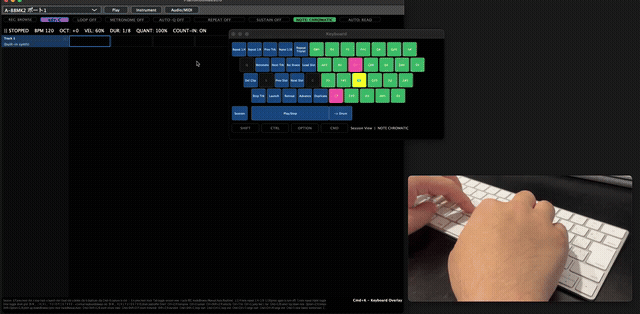
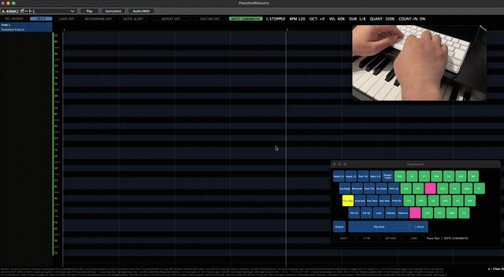
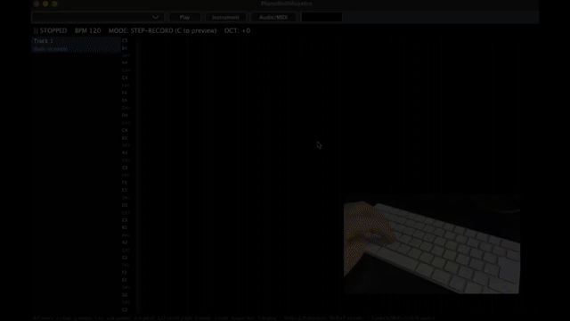

# PianoRollMaestro

A from-scratch, standalone macOS DAW built around one rule: **zero mouse during editing**. The right hand stays on a physical MIDI keyboard the whole time; every navigation and editing command lives on the left hand's side of a PC keyboard.

Built with [JUCE](https://juce.com/) (8.0.3), as a Projucer `guiapp` project.

## Demo

**Day 6** — mouse-free automation: touching a loaded plugin's own knob creates/selects an automation lane for that parameter, and everything else (plotting points, drawing curves) stays entirely on the keyboard:



Muted GIF above — [watch with sound on X](https://x.com/watchan/status/2080018306883547204).

**Day 5** — one-key chord inversion (drop the top note an octave / raise the bottom note an octave), automatic chord detection with degree names (choose which tracks feed the analysis), and real-time recording:



Muted GIF above — [watch with sound on X](https://x.com/watchan/status/2078928639710925098).

**Day 3** — PC-keyboard chromatic note input (freeing up from needing a physical MIDI keyboard), a dedicated MASCHINE-style 4x4 pad grid on the PC keyboard, and the always-visible live shortcut overlay:


Muted GIF above — [watch with sound on X](https://x.com/watchan/status/2076631645638291658).

**Day 2** — Session View, chord estimate, measure numbers, MIDI controller input, and looping in the piano roll:


Muted GIF above — [watch with sound on X](https://x.com/watchan/status/2076254041164967949).

**Day 1** — humming a note in, committing it with `Shift+F`, tying with `T`, switching between 1/8 and 1/8-triplet input:



Muted GIF above — [watch with sound on X](https://x.com/watchan/status/2075808532528795857).

## Why

Step input in mainstream DAWs (Logic, Cubase, Ableton) usually forces you to reach for the mouse constantly. This project scraps that entirely: a piano-roll editor where the cursor, track switching, note editing, and playback are all keyboard-driven, so your hands never have to leave home position.

## Features

- **Step-input MIDI editing** — mouse-free cursor navigation, note entry, ties, pitch/octave nudging.
- **Per-track VST3/AU instrument hosting** — load real plugins per track, or fall back to a built-in synth.
- **4 input modes** — MIDI keyboard and PC keyboard input both feed the same pending-chord slot, cycled with `r`: **Browse** (pure navigation/selection, nothing ever commits), **Manual** (Step REC -- `Ctrl+V` commits explicitly, nothing commits on its own, whole chord at the current duration preset), **Auto** (Step-auto -- same duration-preset behavior, but commits the instant a chord's keys are all released, regardless of transport state), and **Realtime**, a dedicated mode for real-time recording: while the transport is stopped it's pure preview, exactly like Browse -- nothing commits, not even manually, so you can freely check sounds before recording without ever accidentally writing Step input. Starting playback (`Space`) is the one button that begins actual capture -- it writes at the exact playhead position a chord started at, with each note in the chord keeping its own individually-measured length (note-on to note-off), so releasing part of a chord early or holding one note longer is captured exactly as played instead of forcing the whole chord to one shared duration -- Realtime REC only; Manual/Step-auto REC always commit the whole chord at the current commit-duration preset uniformly regardless of how long each key was actually held, since a step sequencer's written length is whatever the grid preset says, not a captured gesture ("ステップRecの時のDurationがなぜかリアルタイムになっている。指定した音価にしたい"). The piano roll shows each Realtime-REC note visibly growing in real time, with a pulsing red block, for as long as it's held -- each pitch grows from its OWN onset independently, and a pitch that gets released while some OTHER note in the chord is still held (so the overall gesture hasn't ended yet) freezes its block exactly where its own note-off happened instead of continuing to visually stretch alongside whatever's still sounding ("Realtime RECの入力時のノートが伸びていく時...一度ノートOFFになったらその時点でノートの入力が止まるようにアニメーション表示でも示してほしい"). Starting playback in Realtime mode gives a 4-beat audible count-in first (clicks only, transport bar shows `... COUNT IN`) -- capturing starts one full beat after the 4th click, i.e. where beat 5 would fall, not on top of the 4th click itself -- so there's time to get ready before it actually starts capturing. Toggle with `Shift+W` (shown as `COUNT-IN: ON/OFF` in the transport bar); off, recording starts capturing immediately instead. The MIDI keyboard/PC keyboard can hold a full chord. Two "anticipation tolerance" allowances make it possible to play slightly ahead of the beat, the way musicians naturally do: a note struck during the count-in (anticipating beat 1, before the count-in's last click) is captured as if it landed exactly on beat 1 instead of not being captured at all; and a note struck within a sixteenth note EITHER side of a loop's wrap point is captured at the loop's start step instead of its own literal raw position -- struck slightly early (anticipating the wrap) or slightly late (e.g. a note landing at what reads like "beat 5" of a 4-beat loop, actually beat 1 of the next lap that this track's own cursor hasn't caught up to reporting yet, since the wrap itself is only checked once per audio block) -- so playing across a loop boundary works the same as playing across a bar line either way ("１小節を繰り返しながらリアルタイムRecした時、5拍目の頭にきたものは1拍目の頭に持ってくるようにしたい"). Every note a Real-time REC gesture just wrote is left selected (`multiSelectedNoteStarts`) the moment it commits, since raw human timing is usually exactly what you're about to quantize away -- `1`/`2`/`3`/`Cmd+U` (or any other bulk action) apply immediately with no separate selection step needed. A pitch that gets struck, released, and struck again while some OTHER note is still being held sustained throughout (so the gesture, as far as `heldMidiNotes` is concerned, never actually ends) -- e.g. a drone note held under a repeating melodic pattern, or Note Repeat re-triggering one pitch while another is held -- commits each of its own repeated occurrences individually the moment the NEXT press of that same pitch happens, instead of only ever keeping the last one and silently discarding every earlier repeat ("リアルタイムREC中に、どれかのノートがONで継続している間に、他のノートがON/OFF, ON/OFFとONOFFが二回以上繰り返されると、繰り返されたノートが記録されず、最後のノートだけ記録されてしまう").
- **Triplet-capable grid** — 960 steps per quarter note (the same ticks-per-quarter-note resolution standard MIDI files and most professional DAWs use), so eighth-note triplets are representable alongside 16th/8th/quarter notes as exact integer step counts, and Real-time REC's raw onset timing is captured at that same high resolution instead of being rounded down to a much coarser grid line ("リアルタイムRecはMIDI限界まで解像度を上げたい。タイミング"). This raises the GRID's own precision ceiling; onset capture is still ultimately bounded by how often the audio engine's own render callback runs (on the order of a few ms, depending on the audio buffer size), not by the grid resolution alone.
- **Note-aware navigation** — jump between notes with `d`/`f`, or move by a fixed duration preset with `c`/`v`; note-off-aware duration editing; whole-note delete.
- **Notes never sound past their own written territory, with a small release gap at the edge** — every note's sounding length is capped to the tie-chain envelope it actually occupies (`Step::lengthInSteps` + its tied continuation), even a real-time-recorded note whose raw measured hold time ran longer than that -- a held note that overshoots into where a later, different note was written otherwise kept sounding well past that note's own onset, an actual overlap rather than just a coincidental same-sample collision. Whenever a note's length reaches that container's edge (either because it's a hand-entered/tied note that always fills the whole thing, or because an over-held real-time note got clamped down to fit), it also releases a little early instead of landing on the identical sample as whatever comes next: at least ~30ms of wall-clock time (or a quarter-step, whichever is larger), capped to at most half the container's own length. Otherwise some plugins (a strumming guitar instrument is what surfaced this) glitch audibly on a same-sample note-off/note-on collision instead of cutting cleanly. A note that legitimately ends earlier than its container isn't trimmed further -- it already isn't touching anything.
- **Piano-roll view controls** — pitch scroll, independent vertical/horizontal zoom, playback locator, a velocity lane along the bottom showing each note's velocity as a bar.
- **Loop/cycle playback** — a project-wide start/end region, set from the edit cursor with a keystroke, that playback wraps around when enabled.
- **Metronome** — an accented click on every downbeat during playback, toggled with a keystroke.
- **Persistent shortcut help bar** — the full key map is always on screen, plus a live "what did I just press" indicator.
- **Audio/MIDI device selection** — with device state persisted across launches.
- **Chord-progression estimate** — a strip above the piano roll guesses the chord from the notes across all tracks, analyzed every half beat so a mid-bar chord change is actually caught (template matching against major/minor/6/7/maj7/m7/sus2/sus4/dim/aug, with slash/"on-chord" notation like `Dm6/F` when the bass note isn't the chord's own root). Only a genuine 3+ note chord sustained for at least a full beat gets labelled -- single notes, dyads, and fleeting passing harmonies are left blank. Consecutive same-chord segments are merged into one span with the label shown once at the step it starts, pixel-aligned to the piano roll's current pan/zoom. Whenever the key estimate is on (`Cmd+M`, below -- not `Off`), each chord's Roman-numeral scale degree relative to the estimated key is shown alongside it in parentheses, e.g. `Dm (ii)`, `G7 (V)`, `Ab (bVI)` for a chromatic root -- case follows the chord's own quality (upper for major-ish, lower for minor-ish), not a full music-theory reading of the key's diatonic function.
- **Session View** — an Ableton-Live-style grid of independently-launchable clip slots per track, alongside the piano roll's linear editing view (toggle with `s`). Each track's slots play back independently of the others (launching a clip on one track doesn't affect what's already playing on another), switching instantly rather than waiting for a bar/loop boundary.
- **Pending-chord auto-clear** — a chord captured from the MIDI/PC keyboard but never committed (`Ctrl+V`) automatically clears itself about 2 seconds after every key was released, so it can't be accidentally written in later by some unrelated action. Its yellow preview (row highlight + locator box) fades out over the last ~0.4s instead of just vanishing, so the clear is visible as it happens. Playing any new note (or re-committing an already-pending chord) cancels/resets the countdown and restores full brightness. The locator box itself is sized to the current commit duration preset (`Shift+Z`/`Shift+X`), not a fixed single step, so it already shows exactly how long the note will be written as -- resizing live as you cycle the preset while a chord is held/pending.
- **Note copy/paste** — `Cmd+C`/`Cmd+V`, standard OS convention. Copies the currently-selected note(s), keeping their relative timing intact as a group when pasted elsewhere.

## Requirements

- macOS, Xcode 16+
- [JUCE](https://github.com/juce-framework/JUCE) checked out locally (point Projucer at it)

## Building

```sh
/path/to/JUCE/Projucer.app/Contents/MacOS/Projucer --resave PianoRollMaestro.jucer
cd Builds/MacOSX
xcodebuild -project PianoRollMaestro.xcodeproj -configuration Debug
```

## Keyboard reference

All commands below use the left hand only; the right hand stays on the MIDI keyboard -- except the virtual keyboard and drum-pad grid, both of which are note-PERFORMANCE inputs (substitutes for a physical MIDI keyboard/drum pads), always active with no modifier held, and are meant to be played with the right hand, unconstrained by the left-hand-only rule, while the left hand stays free for editing commands.

| Key | Action |
|---|---|
| `f` | Pure note-to-note navigation, forward -- jumps straight to the next note's start. If the cursor is on a rest with nothing selected, jumps to the nearest note instead: forward first, and if there's no note ahead, falls back to the nearest note behind instead of doing nothing. Never commits (see `Ctrl+V` below). Duration-preset-only movement is `v` below |
| `Ctrl+V` | Commits the pending chord (from the MIDI/PC keyboard, whichever's pending) into the step grid at the cursor. Only commits while `r` (below) is on -- with it off ("Browse" mode) this is a no-op, never a write -- moved off `Ctrl+F` ("CommitをCtrl Vにする") |
| `d` | Pure note-to-note navigation, backward -- see `f` above (same nearest-note fallback, backward first, then forward). No delete side effect. Duration-preset-only movement is `c` below |
| `a` | Clears whichever note(s) are currently selected (see `Cmd+G`/`Cmd+B` below -- or nothing narrowed, that's the whole chord/note, including its tied continuation steps) -- or the current step if it's a plain rest. Also discards whatever's currently pending so a stray/mis-played note can be cancelled without committing or waiting for a new one to overwrite it |
| `z` / `x` | Octave shift (live input preview) |
| `g` / `b` | Nudge whichever note(s) are currently selected (see `Cmd+G`/`Cmd+B` below) by a semitone, up/down -- or nothing narrowed, that's the whole chord. Moved off `t`/`g` onto `g`/`b`, along with every other key in this file that followed the app's "up means the first key of the pair, down means the second" convention -- originally `t`/`g` before that ("上下を、TGからGBに動かす") |
| `Shift+G` / `Shift+B` | Nudge the note at the cursor by an octave, up/down |
| `Shift+Q` / `Shift+R` | Same up/down note-selection move as `Cmd+G`/`Cmd+B` below, but *adds* to the selection instead of replacing it, for selecting more than one note out of a chord (pitches within a single step) |
| `Shift+A` / `Cmd+Shift+A` | Jump the locator back to the very start (step 0) / forward to the clip's effective end |
| `Shift+D` / `Shift+F` | Extends a separate, TIME-axis multi-note selection back/forward, one note-jump at a time (moves the cursor the same way plain `d`/`f` do, falling back to a duration-preset step on a rest, then adds whatever note it lands on to the selection) -- this is what `Cmd+1`/`Cmd+2`/`Cmd+3`/`Cmd+S` (below) quantize/unquantize. Shown as a cyan outline around every selected note. Any plain `d`/`f` press collapses it back down to just the note under the cursor |
| `Cmd+G` / `Cmd+B` | Select an individual note within the chord at the cursor -- landing on a chord selects all of its notes; the first `Cmd+G`/`Cmd+B` press narrows to just the highest note, then `Cmd+B` moves the selection down and `Cmd+G` moves it up (wrapping around at the top/bottom). `g`/`b` and `a` (above) act on whatever's currently selected instead of the whole chord |
| `Shift+Option+G` / `Shift+Option+B` | In Browse mode (`r`, below): nudges the note at the cursor by a semitone, up/down. Otherwise (Manual/Auto REC mode, or Session View): switch to previous/next track |
| `Option+Z` / `Option+X` | Tempo down/up (1 BPM) |
| `Option+D` / `Option+F` | Nudges the currently-selected note(s) (see `Shift+D`/`Shift+F` above, or just the note under the cursor if nothing's been extended) one base step left/right -- an actual relocation (reuses the same tie-chain/collision-merge logic as quantize), not just cursor movement, and NOT tracked as a quantize record (doesn't touch `Cmd+S` unquantize). While automation edit mode (`Cmd+Ctrl+A`) is on, nudges the selected automation point(s)/event(s) in the active lane instead (all three lanes, including Sustain) |
| `r` | Cycles the REC mode: **Off** (Browse) → **Manual** → **Auto** → **Realtime** → back to Off. Off = pure navigation/selection/pitch-nudge/delete, `Ctrl+V` never commits. Manual = Step REC (confirm) -- `Ctrl+V` commits whenever you press it, nothing commits on its own. Auto = Step REC (auto) -- commits the instant a chord's keys are all released, regardless of transport state (cursor still advances by the duration preset either way, and `Ctrl+V` still works as a manual override). Realtime, while stopped = pure preview, same as Off -- nothing commits at all, not even via `Ctrl+V`, so checking sounds before recording never accidentally writes Step input. Realtime, while playing (start with `Space`, the one button that begins actual capture) = auto-commits to the exact playhead step the chord *started* at, leaving the edit cursor untouched, with the note's length taken from exactly how long it was held (note-on to note-off) rather than the duration preset; the piano roll shows it visibly growing (a pulsing red block) while it's still being held. Shown in the transport bar as `REC: BROWSE` / `REC: MANUAL` / `REC: STEP` / `REC: ARMED` (Realtime, stopped) / `REC: LIVE` (Realtime, playing) |
| `1` / `2` / `4` | Note Repeat: while any note is held (MIDI keyboard or the virtual keyboard/drum grid), automatically re-fires every held pitch at the selected rate (quarter/eighth/sixteenth) for as long as it's held -- a synthetic release-then-re-press through the exact same path a real repeated key-press would take, so it re-triggers the live audio preview and, in Auto/Realtime REC, writes a rolling repeated pattern exactly like tapping the key yourself at that rate would. While playing, each repeat is locked to the transport's own step grid (fires exactly when the playhead crosses into the next multiple of the rate) rather than timed from whenever the key happened to be pressed, so it always lands exactly on the beat in sync with the rest of the song and follows a live tempo change instantly ("NoteRepeatはテンポと同期する"); while stopped, there's no transport grid to lock to, so it falls back to a plain wall-clock interval at the same rate, just for audible preview before recording. Off by default; pressing the already-active rate again turns it off instead of re-selecting it, so these three keys are their own on/off switch too. `5` toggles triplet width for whichever rate is selected. Shown as `REPEAT OFF` / `REPEAT 1/4` / `REPEAT 1/8T` etc. in the transport bar |
| `Cmd+1` / `Cmd+2` / `Cmd+3` | Quantize the currently-selected note(s) (see `Shift+D`/`Shift+F` above, or just the note under the cursor if nothing's been extended) to the nearest quarter/eighth/sixteenth-note grid line, actually relocating them. Non-destructive: each note remembers its original, as-played position internally, so `Cmd+S` (below) can restore it later. Re-quantizing an already-quantized note (e.g. `Cmd+2` then `Cmd+3`) always measures from that remembered ORIGINAL position, never from wherever the previous quantize pass already rounded it to -- so quantizing to 1/8 and then to 1/16 snaps the true as-played timing to 1/16, not the already-rounded 1/8 position to 1/16. If the target position already holds a note, the moved note's pitches merge into it as a chord instead of overwriting it. Moved off plain `1`/`2`/`3` so those digits (and `e`) could become track prev/next in the Piano Roll too |
| `Cmd+4` | Toggle triplet width for `Cmd+1`/`Cmd+2`/`Cmd+3` -- e.g. with it on, `Cmd+2` snaps to an eighth-note-TRIPLET grid instead of a straight eighth-note grid. Shown as `(TRIPLET)` next to the `QUANT: n%` badge in the transport bar -- previously had no visible indicator at all, so it was easy to leave on by accident and be confused why quantize wasn't snapping to the expected straight grid ("100％で1/8になってしまう") |
| `Cmd+S` | Un-quantize the currently-selected note(s) -- moves each one back to its original, as-played position (if it has one) and forgets the quantize record. No-op on notes that were never quantized. On `Cmd+S` rather than `Cmd+5` since `Cmd+5`/`Cmd+R` are the chord-voicing octave shift (below) -- Save moved to `Cmd+0` to make room |
| `Cmd+U` | Cycles the quantize AMOUNT through 25% / 50% / 75% / 100% and back to 25% -- how far `1`/`2`/`3` pulls a note toward the grid line rather than snapping it fully onto it, so some of the original human timing can be kept. 100% (the default) snaps exactly onto the grid, the only behavior this app had before this setting existed. Shown as `QUANT: n%` in the transport bar |
| `Cmd+Shift+U` | Toggle auto-quantize on Real-time REC -- while on, every note a Real-time REC gesture commits is immediately snapped to whatever grid (`Cmd+1`/`Cmd+2`/`Cmd+3`) was last used manually, at the current `Cmd+U` amount/triplet settings, instead of needing a separate quantize press after every take. Off by default (real-time REC's whole appeal is capturing human timing in the first place). Manual/Auto REC are unaffected -- their notes are usually already grid-aligned by construction. Shown as `AUTO-Q ON/OFF` in the transport bar |
| `Cmd+Shift+C` / `Cmd+Ctrl+C` | Drop the loop start / end marker at the edit cursor's current position -- moved off plain `Shift+C` once that became Jump Back 1 Bar (see below), kept on the same letter `C` either way |
| `w` | Toggle the metronome click on/off during playback -- accented on the downbeat of each 4/4 bar |
| `Shift+W` | Toggle Real-time REC's 4-beat count-in on/off (see above) |
| `Cmd+B` | Mark the current track's clip as ending at the edit cursor ("Bound") -- lets a trailing rest be kept intentionally instead of always being trimmed away, and Session View slot loops run out to this point instead of snapping to the last note. Shown as a magenta boundary line with everything past it dimmed. Defaults to 8 bars on a brand-new clip (so it's immediately playable/loopable even before anything's written into it); pressing again at the position that's already the clip end clears it back to automatic (ends right after the last note), same as pressing at step 0. Moved off plain `b`, which was easy to mis-press |
| `b` | Toggle loop/cycle playback on/off (Piano Roll only -- Session View repurposes `b` for Duplicate Clip instead, see below, so toggling the loop isn't reachable from there) -- moved off plain `c` once that became duration-preset retreat, landing here once its own old job (Advance) moved to `v` ("vbはcvに移動する") |
| `Cmd+Ctrl+5` / `Cmd+Ctrl+R` | Drop the range-duplication start / end marker at the edit cursor's current position -- shown as a translucent cyan wash over the marked span |
| `q` / `Cmd+D` | Duplicate the `Cmd+Ctrl+5`/`Cmd+Ctrl+R`-marked range -- inserts a copy of it immediately after itself (pushing everything from there on later in time, not overwriting it), then moves the cursor and both markers onto the new copy so repeated presses chain further copies rightward. No-op if no range is marked |
| `Cmd+5` / `Cmd+R` | Chord voicing: raise the LOWEST currently-selected note an octave / lower the HIGHEST currently-selected note an octave (see `Cmd+G`/`Cmd+B`/`Shift+Q`/`Shift+R` below for narrowing the within-chord selection). Only that one extreme note moves, everything else in the chord stays put. No-op with fewer than 2 notes selected, or if the shift would leave the MIDI range. On Cmd rather than Shift -- Shift+digit combos don't reliably arrive on this keyboard/JUCE setup, so this pair moved back off Shift entirely rather than split across two modifier tiers |
| `c` | Move the locator back by the current duration preset -- pure navigation, doesn't touch step content. Pairs with `v` below (advance) -- moved off plain `v` once `c` gave up Toggle Loop (moved to plain `b`, see above) ("vbはcvに移動する") |
| `v` | Move the locator forward by the current duration preset -- pure navigation, doesn't touch step content. Pairs with `c` above (retreat) -- moved off plain `b` so the pair sits directly beneath `d`/`f` on the keyboard ("vbはcvに移動する") |
| `Shift+Z` / `Shift+X` | Cycle the commit duration preset (16th / 8th-triplet / 8th / quarter) -- always shown as `DUR: 1/16` etc. in the transport bar, not just while a chord happens to be pending ("今指定されている音価がわからない。わかりやすいところに表示したい") |
| `s` | Jump the locator back by one measure (4/4 assumed) |
| `Ctrl+T` | Tie — extend the note at/before the cursor by the current duration preset |
| `Ctrl+G` | Jump the locator forward by one measure (4/4 assumed) |
| `Shift+C` / `Shift+V` | Jump the locator back/forward by one measure (4/4 assumed) -- pairs directly with plain `c`/`v` above (duration-preset step), Shift making the same two keys jump a whole bar instead of one step. Displaces the old `Shift+C` (Set Loop Start, moved to `Cmd+Shift+C` above) |
| `Cmd+X` | Delete+Retreat -- removes the whole note if the cursor is on one, cursor lands at its start |
| `Cmd+C` | Copy the currently-selected note(s) (see `Shift+D`/`Shift+F` above, or just the note under the cursor if nothing's been extended) -- each note's position relative to the earliest one in the group is remembered, so a multi-note copy keeps its internal timing when pasted elsewhere |
| `Cmd+V` | Paste whatever was last copied, at the edit cursor -- each note lands at cursor + its remembered offset. A target that already holds a note gets the pasted pitches merged into it as a chord instead of overwriting it, same as quantize's collision handling |
| `Tab` | Toggle Session View (see below, and start there) -- going into Piano Roll always opens the slot at the cursor (creating a fresh one if empty); everything above still works the same in both views except `d`/`f`/`t`/`z`/`x`/`b`, which Session View repurposes (`3`/`e` now mean the same thing -- prev/next track -- in both views) |
| `Space` | Play / stop |
| `Shift+Space` | Play from the locator -- (re)starts playback with every track's cursor beginning at the edit cursor's current position, instead of always from the very start of the clip |
| `<key>` (hold, virtual keyboard mode) | Virtual keyboard -- a substitute for a physical MIDI keyboard, feeding the exact same live-preview/chord/REC path, no modifier needed. Chromatic, isomorphic "fourths" layout: bottom row `N M , . /` = C C# D D# E, and each row above (`H J K L ; '`, `Y U I O P [ ]`, `6 7 8 9 0 - =`) starts a perfect fourth higher -- so a chord/scale shape is playable roughly the same way anywhere on the grid. `B`/`G`/`T`/`5` (each row's original starting key) are deliberately left out -- they're needed as plain-key editing shortcuts (Duplicate Clip/Jump Back 1 Bar/Tie/Toggle Triplet Quantize) now that this map has no modifier of its own. Notes sound for as long as the key is held (like a real key) |
| `Enter` | Toggles the virtual keyboard between melodic (default) and drum-pad mode for the same physical keys -- see the transport bar's `NOTE: CHROMATIC`/`NOTE: DRUM` badge |
| `<key>` (hold, drum grid mode) | 4x4 drum-pad grid, mostly-shared physical keys with the melodic keyboard above (switched with `Enter`), right-hand like the melodic keyboard. Straight chromatic, 4 rows x 4 columns, no octave overlap between rows, each row starting at the same left-hand-edge key as the melodic keyboard's own rows: `N M , .` = C2-D#2, `H J K L` = E2-G2, `Y U I O` = G#2-B2, `6 7 8 9` = C3-D#3 -- 16 pads spanning MIDI 48-63 (octave numbers in this app's own convention, where MIDI 60 = "C3") |
| `Ctrl+Z` / `Ctrl+X` | Transpose the virtual keyboard down/up by a semitone (does not affect the drum grid) |
| `Ctrl+S` (hold) | Sustain, virtual keyboard only -- while held, releasing a note key keeps it ringing instead of cutting it off, the same as a real sustain pedal. Everything still sustaining gets cut off the moment `Ctrl+S` itself is released. Pressing an already-sustaining key again retrikes it (fresh note-on) and takes it off the sustain hold |
| MIDI sustain pedal (CC64) | A real MIDI keyboard's own physical sustain pedal works the same way as `Ctrl+S` above, but for real MIDI note input -- while held, a real note-off is deferred (kept "held" as far as the app is concerned) until the pedal releases, instead of just affecting the synth/plugin's own audio-side sustain like it used to. This means a Real-time REC'd note's measured length now correctly includes the pedal's sustain tail instead of stopping at the raw key-up moment ("SustainがRecされてない。リアルタイムRecの時") |
| `Ctrl+Shift+Z` / `Ctrl+Shift+X` | Decrease/increase the fixed velocity used by both PC-keyboard note sources (the virtual keyboard and the drum grid) -- neither can report a real physical press-force the way a MIDI keyboard does, so this is the only way to control it. Shown as "VEL: n%" in the transport bar. Piano Roll only: also nudges the stored velocity of whichever note(s) are currently selected (see `Cmd+G`/`Cmd+B`/`Shift+Q`/`Shift+R` below for narrowing the within-chord selection) and plays them back so the change is audible immediately |
| `Cmd+0` / `Cmd+Shift+S` | Save / Save As -- Save moved off `Cmd+S` (now Unquantize, see above) |
| `Cmd+O` | Open |
| `Cmd+N` | New project |
| `Cmd+Ctrl+T` | Add track. Doesn't interrupt playback, and every other track keeps playing completely undisturbed -- while stopped, the view switches to the new (empty) track and the edit cursor resets to step 0, ready to start writing into it, but while playing that jump is skipped (it would otherwise look/feel like playback itself just restarted, since the piano roll follows whatever track is currently being viewed and the new track's own cursor legitimately starts at step 0 of a blank grid) -- switch to the new track manually (`3`/`e` or `Cmd+Ctrl+P`/`Cmd+Ctrl+N`) whenever you're ready to write into it |
| `Cmd+Y` | Open instrument panel |
| `Cmd+P` | Show/hide the current track's plugin editor window -- a single global on/off switch, not remembered per track: once toggled off it stays off across track switches until toggled back on; while on, switching tracks shows whichever track you land on's own window (if it has one). Loading a new instrument turns the switch on and shows its editor right away. Never takes keyboard focus, so the main editor's shortcuts keep working while it's open |
| `Cmd+,` | Open Audio/MIDI settings |
| `Cmd+K` | Show/hide a live keyboard-shortcut overlay window (bottom-right corner) -- a QWERTY-shaped grid where every key's label shows exactly what pressing it right now would do, updating instantly as you hold Shift/Option/Cmd/Ctrl and as the mode (Piano Roll/Session View) or REC state changes. The most recently pressed key is highlighted in yellow (stays lit until the next keypress). Whenever the key estimate is on (`Cmd+M`), every melodic-keyboard key whose note is the estimated key's root is shown in pink instead of the usual green, so the root is visible at a glance while playing. A handful of specific modifier+key combos macOS/JUCE intercept before this app ever sees them (`Cmd+Shift+3` -- screenshot, `Shift+5` -- types `%`, `Option+E` -- dead key) are shown greyed out with why, instead of looking like plain unassigned keys, whenever you're actually holding that exact combo. Never steals keyboard focus, so it can stay open while you keep working in the main window |
| `Cmd+Ctrl+P` / `Cmd+Ctrl+N` | Switch to previous/next track |
| `Cmd+Shift+D` / `Cmd+Shift+F` | Zoom the piano-roll horizontally out/in |
| `Cmd+Shift+G` / `Cmd+Shift+B` | Zoom vertically in/out -- the note grid's pitch rows normally, or the sustain/pitch-bend/filter-cutoff lanes' own height while automation edit mode (`Cmd+Ctrl+A`) is on, kept as two independent controls so zooming one never resizes the other |
| `Cmd+Option+G` / `Cmd+Option+B` | Scroll the piano-roll's visible pitch range up/down |
| `Cmd+M` | Toggle the chord-degree-name/out-of-key-outline key context: Auto ↔ Off. Auto uses a Krumhansl-Schmuckler key estimate (root + major/minor) computed from the actual notes in the piece, updated live as you edit -- not a manually-picked key. Shown as a `KEY: <root>` / `KEY: <root>m` badge in the transport bar, hidden entirely when Off. Every note block whose own pitch class is outside the estimated scale gets a thin red outline (see below for the background row stripe, which is unaffected by this toggle) |
| (background row stripe) | The piano roll's faint row-by-row background tint is fixed to the C-major "white key" pattern always, regardless of the estimated key or the `Cmd+M` toggle -- a static visual reference like a real keyboard's black/white keys, not a dynamic in-key indicator (that's the red note outline above) |
| `Cmd+A` | Select every note in the current track's clip (`multiSelectedNoteStarts`) -- a single following action (delete, transpose, quantize, velocity, ...) then applies to the whole clip at once |
| `Cmd+Ctrl+H` | Toggle whether the current track is included in the chord-progression estimate (multiple tracks can be independently included/excluded, e.g. to exclude drums/percussion) -- shown as a "C" badge next to each track's name in the track list. Moved off plain Cmd+A once that became Select All Notes |
| `Cmd+Z` / `Cmd+Shift+Z` | Undo / redo note edits |
| `Cmd+Ctrl+A` | Toggle automation edit mode (Piano Roll only). The pitch bend/filter cutoff/plugin-parameter lanes beneath the sustain lane are always visible (any of them can receive input -- hardware capture, Touch -- at any time, whether or not this mode is on), but PC-keyboard automation commands (the below keys) only apply to whichever lane is currently selected (`Cmd+Ctrl+L`), and only while this mode is on. Keyboard-only, no mouse -- move the cursor with `d`/`f`, adjust the pending value, then drop a point; enough points close together reads as a curve |
| `Cmd+Ctrl+L` | Cycle which automation lane is being edited: Sustain → Pitch Bend → Filter Cutoff → each plugin-parameter lane (one per parameter that's actually been touched at least once, see `Cmd+Ctrl+W` below) → back to Sustain. The active lane is outlined in the piano roll. A plugin-parameter lane only ever gets CREATED by physically touching the plugin's own knob in Touch mode -- that's the intuitive part, picking which of a plugin's however-many parameters you even want a lane for -- but once it exists it's a full automation lane like any other: every key below (value up/down, insert/delete a point, curve type/amount, copy/paste) works on it exactly like Pitch Bend/Filter Cutoff, no-op only on the handful of keys that are Sustain-specific to begin with |
| `d` / `f` | While automation edit mode is on, these jump straight to the previous/next existing point or event in the active lane instead of their usual note/step navigation -- holds still past the first/last point (no wraparound), or falls back to plain single-step movement if the lane has no points yet |
| `Cmd+Ctrl+S` | (Sustain lane) Toggle a sustain on/off point at the cursor |
| `g` / `b` (+ `Shift` for a bigger step) | (Pitch Bend / Filter Cutoff lanes) Adjust the pending value up/down -- if a point already sits exactly at the cursor it moves right away, otherwise this only changes what the next `Cmd+Ctrl+I` will place. Follows the app's usual "up means the first key, down means the second" convention, overriding their normal semitone-pitch-nudge meaning while automation edit mode is on -- originally `t`/`g` ("上下を、TGからGBに動かす") |
| `Ctrl+V` (or `Cmd+Ctrl+I`, same thing) | (Pitch Bend / Filter Cutoff lanes) Insert/overwrite a point at the cursor with the current pending value -- same physical key as committing a note (`Ctrl+V`), overriding its normal meaning while automation edit mode is on |
| `a` (or `Cmd+Ctrl+D`, same thing) | Delete the point/event (any lane) at the cursor -- same physical key as clearing a note (`a`), overriding its normal meaning while automation edit mode is on. Also matches note-clearing's own behavior for what happens afterward: the cursor jumps to the nearest remaining point *before* it, or the nearest one *after* if there's none before, or back to bar 1 if the lane is now empty entirely |
| `Cmd+Ctrl+V` | (Pitch Bend / Filter Cutoff lanes) A point's curve type shapes the segment *arriving* at it from the previous point, not the one it sends onward. Toggles that point's own type between Curve and Step if one already sits at the cursor, otherwise toggles the *pending* curve type -- what the next `Ctrl+V`/`Cmd+Ctrl+I` placement will use, shown live in the ghost preview below. No-op on the Sustain lane. The curve name/amount is shown as text next to the cursor either way |
| `Cmd+Ctrl+Z` / `Cmd+Ctrl+X` (+ `Shift` for a bigger step) | (Pitch Bend / Filter Cutoff lanes) Adjust the curve *amount* -- a continuous signed strength from -1.0 (strongest Ease Out) through 0 (Linear) to +1.0 (strongest Ease In), the same "tension" a segment gets in Ableton Live/FL Studio/Cubase/Logic's own automation editors, replacing the old fixed discrete Ease In/Ease Out shapes. If a point already sits exactly at the cursor its amount moves right away, otherwise this only changes what the next placement will use. Only meaningful when the point's curve type is Curve (`Cmd+Ctrl+V`), not Step |
| (pending-point preview) | While there's a value ready to place (see `g`/`b` above), a faint dashed line/curve shows exactly what committing right now (`Ctrl+V`) would draw, with both segments correctly shaped -- the incoming segment from the previous point uses the pending curve type/amount (`Cmd+Ctrl+V`/`Cmd+Ctrl+Z`/`X`), the outgoing segment to the next point uses that next point's own curve type/amount (unaffected by what's inserted before it). This way the shape *and* position of a not-yet-placed point can be judged together before committing, rather than only after. A hollow ring marks where the point itself would land |
| (pitch bend / filter cutoff hardware capture) | A real MIDI pitch wheel or mod wheel (CC74) moved anytime the transport is actually playing (any REC mode, not just Realtime -- relaxed to match the equally permissive plugin-parameter Touch capture, see `Cmd+Ctrl+W` below) is recorded into the matching lane automatically, the same way the sustain pedal is -- no need to switch into automation edit mode just to capture a live performance's wheel movement, only to hand-draw or fine-tune it afterward |
| `Shift+D` / `Shift+F` | While automation edit mode is on, these extend a multi-point selection (jumping point to point, same as plain `d`/`f`, but accumulating instead of replacing) -- mirrors `Shift+D`/`Shift+F`'s note-selection behavior exactly. A following `a`/`Cmd+Ctrl+D` (delete), `g`/`b` (value adjust -- shifts every selected point by the same delta, keeping their relative differences), `Option+D`/`Option+F` (moves every selected point one step left/right), `Cmd+Ctrl+Z`/`X` (curve amount adjust, same relative-shift behavior), or `Cmd+Ctrl+V` (curve/step toggle) then acts on every selected point at once. Selected points get a cyan ring around their marker. Plain `d`/`f` collapses back to a single point, same "Shift extends, plain move collapses" convention as notes |
| `Cmd+C` / `Cmd+V` | While automation edit mode is on, these copy/paste the selected point(s) in the current lane (or just the one at the cursor) instead of notes -- pasted points land at the cursor, keeping their original spacing relative to each other, same as note copy/paste |
| `Shift+A` / `Cmd+Shift+A` | Jump to the very start (step 0) / effective end of the clip -- plain cursor movement, unaffected by automation edit mode, so it behaves identically whether editing notes or automation. `Cmd+Shift+A` (Jump to End) is new alongside this feature, since neither mode had an end-jump before |
| `Cmd+Ctrl+W` | Toggle plugin-parameter automation between Read and Touch (shown as `AUTO: READ` / `AUTO: TOUCH` in the transport bar, red while Touch is on). Read always plays back whatever's already recorded. Touch's behavior depends on the transport: while playing, physically moving a knob in a loaded plugin's own GUI window (mouse is the only way to do this -- plugin GUIs are third-party and exempt from the mouse-free rule) writes automatically, same as any DAW's Touch mode -- releasing the control ends recording for it immediately. While STOPPED, touching a knob doesn't write anything by itself (there's no playhead position to write a point at yet) -- instead it's a live preview: the touched parameter's lane becomes the active one (auto-creating it and switching to its track the first time that parameter's touched, same "the knob picks the parameter" idea either way), and its point at the current cursor position tracks the knob's value in real time, shown as a hollow dashed marker on the lane -- `Cmd+Ctrl+I` commits it right where the cursor is, exactly like drawing a Pitch Bend/Filter Cutoff point by hand. If moving one control changes several plugin parameters at once (a macro knob, linked/morphed parameters), every one of them previews its own ghost marker on its own lane simultaneously -- not just whichever lane is currently selected -- and `Cmd+Ctrl+I` commits all of them together at the same step in one press. Uses JUCE's standard gesture-begin/end pair to tell a genuine physical touch apart from a value change the plugin made itself (preset load, internal LFO, or the app's own playback applying already-recorded automation). Persisted per clip, matched back to the live plugin by a stable parameter ID (not index) so it survives most plugin updates; if a saved lane's parameter isn't found on the currently loaded plugin, it's kept in the file but simply not applied. A plugin editor window can never take real OS keyboard focus at all (it's created with `ComponentPeer::windowIgnoresKeyPresses`, JUCE's own mechanism for exactly this) -- physically clicking/dragging its knobs still works normally (macOS doesn't require a window to be "key" to receive mouse clicks), but every keypress always keeps going to the main editor, so PC-keyboard note input/shortcuts are never interrupted while a plugin window is active, and there's nothing for macOS to beep at |

Loop playback (`b`, Piano Roll only): two kinds, depending on whether the Loop Start/End markers (`Cmd+Shift+C`/`Cmd+Ctrl+C`) have actually been set. If they have, the region between them (shown as an orange bar along the top of the piano roll, project-wide, not per-track) is what loops -- once playback reaches the end marker, it jumps back to the start marker and keeps playing. If they haven't (no marker region set), looping falls back to the longest currently-playing main-clip track's own end instead (the same point a normal playthrough would otherwise stop at -- see `Cmd+B`/clip-end above) -- every track wraps back to its own start together once that longest one is done, rather than the transport stopping. Either way, the wrap point is a fixed sample position computed the same way on every single pass (so the loop lands on the same spot every time, not drifting/wobbling from cycle to cycle depending on what happened to still be sounding right at the boundary -- "クリップ終わりでループで戻る時拍が一定じゃない。乱れる"), and the wrap itself is quantized to the audio block size (a few ms), not sample-accurate.

### Session View

The app starts here, not in Piano Roll -- Session View is the only way into Piano Roll, and entering it (`s` or `t`) always opens a specific, linked slot (creating a fresh one if it was empty). There's no "floating" editing buffer that exists outside this grid.

Rows = tracks, columns = clip slots -- each track's clips laid out left-to-right (rotated from Ableton's own track-as-column layout), docked directly beside the always-visible track list on the left. The intent: a vertical column (one slot index, across every track) reads as a single song section (verse, chorus, ...) you can eventually arrange left-to-right into a full song, rather than a stack of scenes for live-performance launching. At least 8 slot columns are always shown as empty placeholders, growing further if you capture into or navigate past slot 8.

| Key | Action |
|---|---|
| `3` / `e` | Move to the previous/next track (row) -- same as `Cmd+Ctrl+P`/`Cmd+Ctrl+N`, which also still work in both views |
| `d` / `f` | Move the slot cursor to the previous/next slot (column) |
| `z` | Stop the current track (silences it, independent of every other track) |
| `x` | Launch the slot at the cursor on the current track (no-op if it's empty) |
| `Cmd+X` | Capture the current track's piano-roll clip into the slot at the cursor (grows the track's slot list if needed), and live-links the editor to that slot (see below) |
| `t` | Load the slot at the cursor into the piano-roll editor, live-link it the same way, and switch back to Piano Roll view -- if that slot is empty, creates a fresh clip there first, so there's always something to start writing into |
| `a` | Delete the clip at the cursor (clears it back to empty). No-op on an already-empty slot. Stops the track first if it was playing that slot, and unlinks it from the piano-roll editor if it was live-linked there |
| `b` | Duplicate the clip at the cursor into the next slot (overwriting whatever was already there), then moves the cursor onto the new copy -- repeated presses chain copies rightward. No-op on an empty slot (nothing to duplicate) |

A slot cell is filled grey once it has a captured clip, bright green while it's the track's currently-launched/playing slot, and outlined in blue at the cursor position. Launching is instant (no bar/loop-boundary quantization in this version) and only affects the track it's launched on -- other tracks keep playing whatever they already were. Whole-column ("song section") launching isn't implemented yet.

**Editing a specific clip:** once a slot has been captured (`g`) or loaded (`t`), the piano roll's editing buffer is live-linked to it -- every further edit made in Piano Roll view is automatically written back to that same slot, no repeated `g` needed. The link is per-track and stays in place until you load/capture a *different* slot. To start a brand-new clip, move the slot cursor to an empty column and press `t` -- it creates a fresh clip there and opens it, already linked.

## Project structure

- `Source/ProjectModel.*` — data model (`Project` → `Track` → `MidiClip` → `Step`), XML save/load.
- `Source/PlaybackEngine.*` — sample-accurate scheduler, per-track plugin/synth rendering.
- `Source/MidiInputRouter.*` — physical MIDI keyboard (and PC-keyboard) input, a pure live monitor feeding the pending-chord slot.
- `Source/ChordEstimator.*` — template-matching chord-progression guesser, one symbol per bar.
- `Source/PluginHost.*` — VST3/AU scanning and hosting.
- `Source/MainEditorComponent.*` — top-level UI, keyboard command dispatch.
- `Source/*Component.h` — individual UI panels (step grid, chord bar, track list, transport bar, shortcut help).
